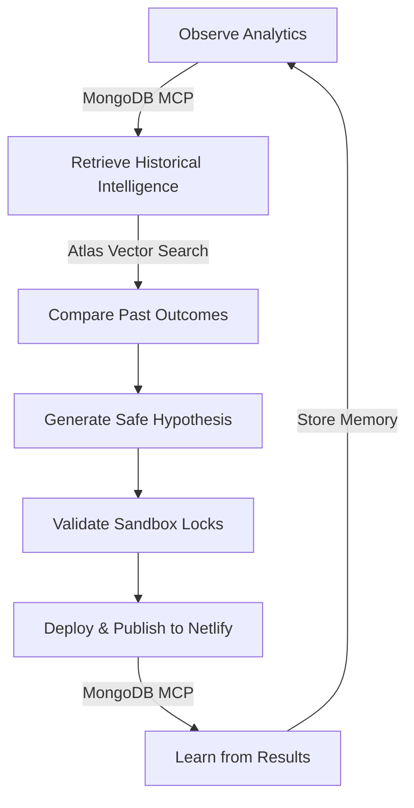

# 🚀 Break-Even - Small Business Management Platform & AI OS

Break-Even is a comprehensive full-stack platform designed to help small business owners manage their operations, analyze performance, and grow their brand through intelligent automation, analytics, and self-improving AI services.

---

## 🧠 The Intelligence & Memory Backbone: MongoDB (Atlas)

At the core of Break-Even's self-improving architecture lies **MongoDB (Atlas)**. Instead of acting as a simple database wrapper, MongoDB serves as the **persistent contextual intelligence layer** that drives the entire AI agent optimization loop.



### How MongoDB MCP Drives the Platform

1. **🧠 RAG Memory Layer**: The AI Copilot queries historical optimization memories, searches successful layouts, and identifies conversion-improving patterns (e.g., *"Spa websites with CTA above fold improved bookings by 18%"*) directly through MongoDB MCP.
2. **📊 Business Analytics Retrieval**: The orchestrator retrieves sales statistics, QR counter scans, bounce rates, and booking conversion logs via MCP tools to drive metric-grounded optimization.
3. **🔁 Self-Improving Loop**: MongoDB MCP closes the feedback loop: **Observe → Store Result → Learn → Retrieve Later → Improve Again**. Without this persistent storage layer, the system has no learning memory.
4. **🧬 Atlas Vector Search**: Drives semantic memory retrieval, similarity searches on layouts, and industry-specific business pattern intelligence.
5. **❌ Failed Patch Memory**: Records failed optimizations, rejected patches, and low-performing experiments to ensure the agent swarm never repeats a layout mistake.
6. **🏢 Multi-Business Context Isolation**: Isolates memory contexts by business owner ID and industry (e.g., keeping law firm optimization templates separate from beauty salon treatments).
7. **🤖 Agent Tool Swarm**: Exposes high-level tools for active agent execution, including:
   - `query_business_memory()`
   - `persist_optimization_event()`
   - `retrieve_conversion_patterns()`
   - `get_business_metrics()`
   - `store_failed_patch()`
   - `search_layout_successes()`

### The MongoDB (Atlas) Difference

* **Without MongoDB MCP**: The system would be a generic, stateless AI builder: **Prompt → Generate → Deploy**.
* **With MongoDB MCP**: The system becomes a learning operating system: **Observe Analytics → Retrieve Historical Intelligence → Compare Past Outcomes → Generate Safe Hypothesis → Validate → Deploy → Learn From Result**.

---


## ✨ Features

### 📊 Business Analytics Dashboard
- **Sales & Revenue Tracking**: Monitor daily, weekly, and monthly revenue trends and order volumes with interactive charts.
- **Customer Analytics**: Track customer acquisition, retention rates, and active client statistics.
- **Product Insights**: View performance charts detailing your highest-converting and best-selling products.
- **QR Code Scan Analytics**: Track customer engagement levels from counter/table scans.

### 🛍️ Product & Inventory Management
- **Catalog Management**: Easily add products with descriptions, pricing, inventory levels, and categories.
- **Inventory Tracking & Alerts**: Keep stock counts accurate with automatic low-stock alerts.
- **Dynamic Updates**: Changes to products instantly synchronize across your digital storefronts.

### 💬 Centralized Communication & CRM
- **Customer Inbox**: A centralized message center to organize inquiries, orders, and customer feedback.
- **Real-time Messaging**: Send and receive instant replies with customers to streamline communication.
- **Client Sentiment & Feedback**: Collect feedback and automatically calculate Customer Satisfaction Scores (CSAT).

### 🧠 Self-Improving AI Copilot Drawer (RAG Engine)
- **Reflective Loop Swarm**: Streams live optimization thoughts to the frontend drawer via Socket.IO: `Observe` → `Retrieve (RAG)` → `Analyze` → `Generate Hypothesis` → `Propose Patch` → `Validate (Sandbox)` → `Present`.
- **Side-by-Side Delta Viewer**: Review layout patch details (before/after) side-by-side before approving and deploying.
- **Secure Sandbox Locks**: Automated validator testing to prevent script injections or responsive layout breaks.
- **MongoDB Atlas Vector Search**: Queries vector embeddings of historical layout configurations using Atlas Vector Search with a fast local NumPy-based fallback.

### 🌐 AI Website Builder & Custom Industry Engines
- **Describe-to-Generate**: Build customized, responsive websites by describing your business in plain English.
- **Professional Law Firm Engine**: Generates law firm landing pages with attorney bios, practice areas, consultation scheduling, and custom business card downloads.
- **Spa & Beauty Salon Engine**: Generates luxury spa websites containing service price lists, staff member specializations, and direct booking calendars.
- **One-Click Netlify Publishing**: Deploys websites instantly to the web via automated Netlify API pipelines.

### 🔑 Authentication & OAuth Security
- **Unified Sign-in**: Standard username/password registration and login.
- **Google & Microsoft OAuth**: Seamlessly authenticate via Google or Microsoft accounts.
- **Developer Mock Sign-in**: Accepts `mock_google_...` or `mock_ms_...` tokens to bypass OAuth APIs for rapid local developer loops.

### 🌐 Dynamic Translation Layer
- **Multi-lingual Support**: Supports English, Hindi, and Telugu.
- **Gemini Translation Service**: Translates UI text and deployed website content on-the-fly using the Gemini API.
- **Optimized Caching**: Stores translated phrases in a local cache for immediate loading speeds.

---

## 🛠️ Tech Stack

### Frontend
- **React 18** (Modern functional components, context states, and hooks)
- **Tailwind CSS & Vanilla CSS** (Highly premium, responsive glassmorphism styles)
- **Lucide Icons & Framer Motion** (Clean iconography and micro-animations)
- **Recharts** (Interactive data visualization graphs)
- **Socket.IO-Client** (Real-time agent log streaming)

### Backend
- **Python / Flask** (Secure endpoints, routing, and controller layers)
- **Flask-SocketIO / Eventlet** (Live thought-streaming socket server)
- **PyMongo** (MongoDB interaction layer with custom indexing)
- **Google Generative AI** (Gemini-1.5-flash for hypothesis and translations; text-embedding-001 for vector embedding)
- **Numpy** (High-speed local mathematical cosine similarity fallback)

---

## 🚀 Quick Start

### Prerequisites
- Node.js (v18+)
- Python (v3.9+)
- MongoDB (running locally or on Atlas)

### Setup & Installation

1. **Clone the Repository**
   ```bash
   git clone https://github.com/Pranavipulluri/break-even.git
   cd break-even
   ```

2. **Database Startup**
   Start MongoDB locally:
   ```bash
   mongod --dbpath "./backend/mongodb_data" --port 27017
   ```

3. **Backend Setup**
   ```bash
   cd backend
   python -m venv venv
   source venv/Scripts/activate  # On Windows: venv\Scripts\activate
   pip install -r requirements.txt
   ```
   Create a `.env` file in `backend/` and add your keys:
   ```env
   MONGO_URI=mongodb://localhost:27017/break_even
   GEMINI_API_KEY=your_gemini_api_key_here
   NETLIFY_AUTH_TOKEN=your_netlify_token_here
   ```
   Start the backend server:
   ```bash
   python run.py
   ```

4. **Frontend Setup**
   ```bash
   cd ../frontend
   npm install
   npm run start:3001
   ```

5. **Access the App**
   Open your browser at `http://localhost:3001`.

---

## 📁 Project Structure

```
break-even/
├── backend/
│   ├── app/
│   │   ├── routes/          # Auth, law firm, salon, translation, website routes
│   │   ├── services/        # Orchestrator, RAG memory, patch engine, validators
│   │   └── utils/           # Database setup, validators
│   ├── run.py               # Main Flask & Socket.IO server entry point
│   ├── requirements.txt     # Python backend dependencies
│   └── .env                 # Environment secrets (ignored)
└── frontend/
    ├── src/
    │   ├── components/      # UI components (Copilot drawer, chatbot, common headers)
    │   ├── context/         # Auth, App, and Translation Context Providers
    │   ├── pages/           # Dashboard, Website Builder, Analytics, Settings
    │   ├── services/        # Axios APIs, WebSocket service, mock auth helpers
    │   └── App.jsx          # React app entry router
    ├── package.json         # Frontend configuration
    └── postcss.config.js    # Tailwind configuration
```

---

## 🎮 How to Use

### Dashboard
- **View Stats**: Monitor revenue, active customer count, and scan statistics at a glance.
- **Sales Charts**: Filter and analyze your performance trends over 7 days, 30 days, or a custom timeframe.

### AI Copilot Drawer
- Click the **AI Copilot** tab on the side of the screen to open the Reflective Optimization loop.
- Input a goal (e.g., "Optimize my homepage for better conversions") and watch the agent swarm run and present its layout hypothesis, expected impact calculations, and side-by-side patch diff.
- Approve the patch to instantly deploy the optimized HTML to disk and trigger Netlify publishing.

### Website Builder
- Go to "Website Builder" and select your industry type.
- Describe your company profile, USP, and offerings.
- Use **Create Professional Law Firm Website** or **Create Professional Spa Website** to build industry-specific features, deploy to Netlify, and generate downloadable business cards.

---

## 🤝 Contributing

We welcome contributions! Here's how you can help:

1. **Fork the repository**
2. **Create a feature branch** (`git checkout -b feature/amazing-feature`)
3. **Commit your changes** (`git commit -m 'Add amazing feature'`)
4. **Push to the branch** (`git push origin feature/amazing-feature`)
5. **Open a Pull Request**
